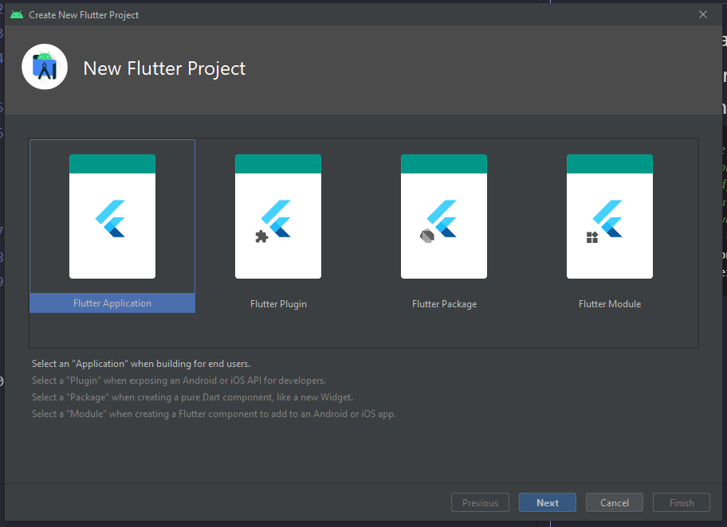
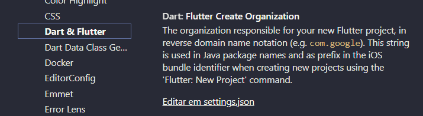
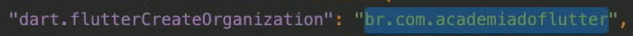
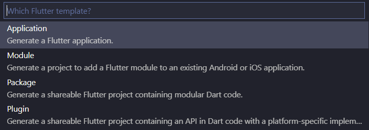

# Módulo 10 - Flutter primeiros passos

## Criando emulador android
## Criando seu primeiro projeto pela linha de comando e abrindo no Android Studio e VsCode
```bash
#flutter create --project-name=flutter_primeiros_passos --org br.com.danielmorita --platforms web,ios,android,mac,windows,etc
# -a => java ou kotlin
# -i => Objectve-C ou swift
flutter create --project-name=flutter_primeiros_passos --org br.com.danielmorita --platforms android,ios -a kotlin -i swift ./flutter_primeiros_passos
```

## Criando seu primeiro projeto pelo Android Studio



## Criando seu primeiro projeto no Visual Studio Code
Dê preferência para a linha de comando, mas segue configuração.


1. Adicionar o nome da organização na config do VS Code

Arquivo -> Preferências -> Configurações

em seguida digite na busca por `flutter create`

e procure por essa config na imagem abaixo.


Exemplo



2.


View (Ver) -> Command Palette (Paleta de Comandos)

ou

```
Ctrl + Shift + p
```

e digite flutter new project.




## Iniciando o emulador do IOS (Iphone) e Rodando o seu projeto nele
1. Verificar se existe o xcode, caso não tenha deve instalar. 
  
    a. Abra a `App Store` e procure pelo `Xcode`

2. Abrar o VS Code e inicie o emular clicando em `No Device`.

3. Para abrir o projeto, basta clicar com o botão direito na pasta `ios` e selecionar `Open in Xcode` ou abrir o arquivo Runner.xcworkspace `open ios/Runner.xcworkspace`

## Preparando e rodando seu aplicativo no Aparelho Físico Android
- Programa para emular o dispositivo fisico no pc com `Wormhole`

1. Vá em `Configurações` -> `Sobre o telefone` -> `Informações do software` -> `Número de compilação`.
2. clique várias vezes no `Número de compilação` para ativar o modo desenvolvedor, irá aparecer uma mensagem.
3. Vá em `Configurações` -> `Opções do desenvolvedor`
4. Habilitar a opção `Permanecer ativo`.
5. Habilitar a opção `Depuração USB`.