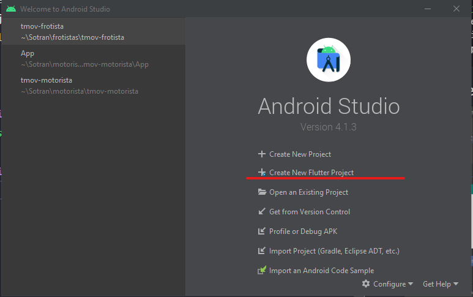

# Módulo 10 - Flutter primeiros passos

## Criando emulador android
## Criando seu primeiro projeto pela linha de comando e abrindo no Android Studio e VsCode
```bash
#flutter create --project-name=flutter_primeiros_passos --org br.com.danielmorita --platforms web,ios,android,mac,windows,etc
# -a => java ou kotlin
# -i => Objectve-C ou swift
flutter create --project-name=flutter_primeiros_passos --org br.com.danielmorita --platforms android,ios -a kotlin -i swift ./flutter_primeiros_passos
```

## Criando seu primeiro projeto pelo Android Studio



## Criando seu primeiro projeto no Visual Studio Code
Dê preferência para a linha de comando, mas segue configuração.


1. Adicionar o nome da organização na config do VS Code

Arquivo -> Preferências -> Configurações

em seguida digite na busca por `flutter create`

e procure por essa config na imagem abaixo.


Exemplo


2.


View (Ver) -> Command Palette (Paleta de Comandos)

ou

```
Ctrl + Shift + p
```

e digite flutter new project.


