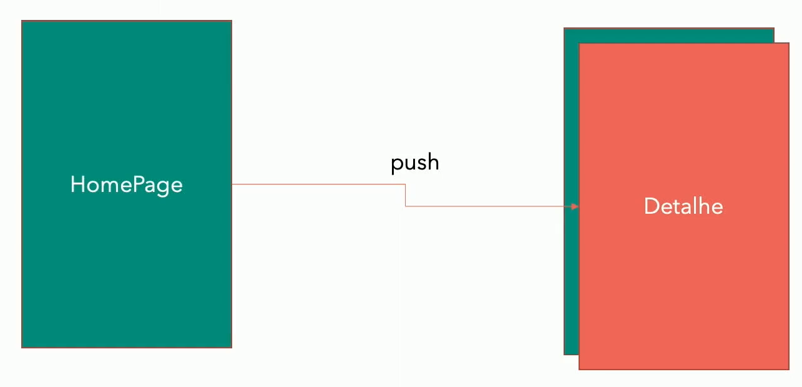

# Módulo 12 - Flutter mão na massa

```bash
flutter create --project-name=flutter_maonamassa --org br.com.danielmorita --platforms android,ios -a kotlin -i swift ./flutter_maonamassa
```

## Principais Widgets
[lista todos os widgets](https://flutter.dev/docs/reference/widgets)

## Imagens
- Deve configurar o local (path) das imagens no pubspec.
- Cada dispositivo tem suas resoluções, é possivel configurar o tamanho de cada imagem, criando uma pasta "2.0x ou 3.0x", com o mesmo nome
## Customizando as fonts
- Baixe os arquivos fonts e adicione no assets.
- Deve configurar o local (path) das fonts no pubspec.
- caso queira adicionar a lib do [google fonts](https://pub.dev/packages/google_fonts).
  - problema: caso o dispositivo não estiver com internet não irá baixar a font, apenas na primeira vez.


## Navegação

### Conceitos
- `Conceito de Pilha`

- `Formas de navegação:`
  1. Páginas
  ```dart
    Navigator.of(context).push(
      MaterialPageRoute(builder: (_) => DetalhePage()),
    );
  ```
  2. Nomes
  ```dart
    Navigator.of(context).pushNamed('/detalhe');
  ```
- `Tipo de navegação`
  - Existe 5 formas de navegação
    - Para Páginas:
      - push **(um em cima da outra)**
      - pushAndRemoveUntil **(ir para a pagina e remover as outras)**
      - pushReplacement **(substituir a pagina atual por outra)**
    - Para Nomes:
      - pushNamed **(um em cima da outra)**
      - pushNamedAndRemoveUntil **(ir para a pagina e remover as outras)**
      - pushReplacementNamed **(substituir a pagina atual por outra)**
    - Para Amboms:
      - popUntil **(remova até alguma condição)**
      - pop **(remove a tela ativa ou seja a tela atual)**
- `Push and PushNamed`
  - empilha as telas uma em cima da outra.
- `PushAndRemoveUntil and PushNamedAndRemoveUntil`
  - Passa a condição para remover, exemplo;
    - Adiciona a página 1 e remove até a página 2.
- `PushReplacement and PushReplacementNamed`
  - Tirar a página atual por outra.
- `Pop`
  - Remove a página ativa
- `PopUntil`
  - remove até a página desejada, exemplo: "PopUntil Page2"
    - Page4 (remove)
    - Page3 (remove)
    - Page2 (não remove => Page2 é igual Page2)
    - Page1


### Mão na massa
### Passando parametros